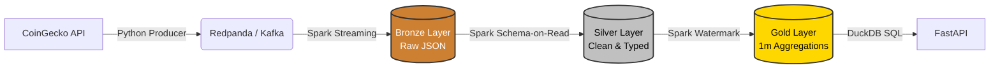

# CryptoStream Lakehouse

## Project Overview

CryptoStream Lakehouse is an end-to-end data pipeline that ingests near-real-time cryptocurrency market data, processes it using Spark Structured Streaming, and stores it in a Delta Lake architecture with Bronze, Silver, and Gold layers.

## Current Implementation

### Architecture



- **Data Source:** CoinGecko API (free tier)
- **Message Broker:** RedPanda (Kafka-compatible)
- **Processing Engine:** Apache Spark 3.5.0 with Delta Lake
- **Storage Format:** Delta Lake (Parquet-based)
- **Monitoring:** RedPanda Console

### Data Pipeline

#### 1. Producer (`producer/src/`)

Python-based producer that:

- Fetches data from CoinGecko API for 10 cryptocurrencies
- Publishes to `crypto-raw` Kafka topic every 10-15 seconds
- Includes: price, 24h volume, market cap, price changes

**Tracked Cryptocurrencies:**
Bitcoin, Ethereum, Solana, Cardano, Ripple, Polkadot, Dogecoin, Chainlink, Tron, Avalanche

#### 2. Bronze Layer (`storage/bronze/crypto_raw`)

Raw ingestion from Kafka:

- Spark Structured Streaming reads from RedPanda
- Stores raw JSON events with ingestion timestamp
- No transformations applied
- Script: `producer/src/bronze_ingestion.py`

#### 3. Silver Layer (`storage/silver/crypto_transformed`)

Cleaned and enriched data:

- Parses JSON and extracts structured fields
- Adds timestamp columns (year, month, day, hour)
- Deduplication and schema enforcement
- Script: `producer/src/silver_transformation.py`

#### 4. Gold Layer (`storage/gold/crypto_metrics_1m`)

Aggregated analytics:

- 1-minute windowed metrics (average, min, max price)
- Calculated price changes and volatility
- Ready for analytics and visualization
- Script: `producer/src/gold_aggregation.py`

## Project Structure

```bash
cryptostream-lakehouse/
├── infra/
│   └── docker-compose.yml    # RedPanda + Spark cluster
├── producer/
│   ├── requirements.txt       # Python dependencies
│   └── src/
│       ├── main.py           # Producer application
│       ├── api.py            # API client
│       ├── bronze_ingestion.py
│       ├── silver_transformation.py
│       ├── gold_aggregation.py
│       ├── verify_silver.py
│       └── verify_gold.py
├── storage/
│   ├── bronze/               # Raw data layer
│   ├── silver/               # Transformed data layer
│   ├── gold/                 # Aggregated metrics layer
│   └── checkpoints/          # Spark streaming checkpoints
└── README.MD
```

## Getting Started

### Prerequisites

- Docker and Docker Compose
- Python 3.8+
- PySpark 3.5.8

### Setup

1. **Start Infrastructure:**

   ```bash
   cd infra
   docker-compose up -d
   ```

   - RedPanda: `localhost:19092`
   - RedPanda Console: `http://localhost:8080`
   - Spark Master UI: `http://localhost:8090`

2. **Install Python Dependencies:**

   ```bash
   cd producer
   pip install -r requirements.txt
   ```

3. **Run Producer:**

   ```bash
   cd producer/src
   python main.py
   ```

4. **Run Streaming Pipeline:**

   ```bash
   # Bronze ingestion
   python bronze_ingestion.py
   
   # Silver transformation (in separate terminal)
   python silver_transformation.py
   
   # Gold aggregation (in separate terminal)
   python gold_aggregation.py
   ```

5. **Verify Data:**

   ```bash
   python verify_silver.py
   python verify_gold.py
   ```

## Features Implemented

✅ Continuous data ingestion from CoinGecko API  
✅ Kafka/RedPanda message streaming  
✅ Spark Structured Streaming processing  
✅ Delta Lake storage with ACID transactions  
✅ Bronze → Silver → Gold medallion architecture  
✅ Windowed aggregations (1-minute windows)  
✅ Checkpointing for fault tolerance  
✅ Local development environment via Docker
✅ RESTful API serving Gold metrics with millisecond latency
✅ In-memory analytical queries using DuckDB

## Technology Stack

- **Python 3.x** - Producer and data scripts
- **Apache Spark 3.5.0** - Stream processing
- **Delta Lake 3.1.0** - Storage format
- **RedPanda** - Kafka-compatible message broker
- **Docker** - Containerization
- **CoinGecko API** - Data source
- **FastAPI & Uvicorn** - REST API framework
- **DuckDB** - In-process analytical database

## Next Steps

- **Data Persistence** - Save fetched data in a real database
- **Dashboard** - Create a web page to show informational dashboards with the currencies prices evolutions
